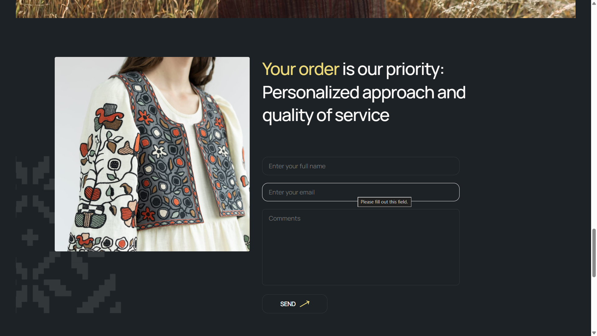

# 🪡 **Vyshyvanka Vibes**

### _Responsive front-end e-commerce template_

---

## 📍 **Project Overview**

**Vyshyvanka Vibes** is a responsive front-end template for an e-commerce website inspired by traditional Ukrainian embroidery.
The project demonstrates strong skills in **semantic HTML**, **modern CSS**, and **vanilla JavaScript**, with a clear focus on layout accuracy, responsiveness, and user interaction.

Developed as a **team project**, it reflects real-world collaboration practices, including task coordination, section ownership, and structured UI implementation based on a Figma design.

## 🧑‍💼 My Role & Contribution

**Scrum Master & Front-End Developer**

- Facilitated sprint planning, daily stand-ups, and team coordination within an Agile workflow  
- Managed backlog and task prioritisation using **Trello**, ensuring clear ownership and timely delivery  
- Acted as the communication link between design and development teams  

**Order Section Developer**

- Implemented the order form using semantic HTML and modular CSS  
- Developed client-side validation for user inputs (name, email) with clear inline error messaging  
- Handled submission success states and logged structured form data using JavaScript  

---
## 🖼️ Preview

---

## 🧱 Project Scope

- Designed and implemented responsive UI sections: **Hero, About, Collection, Order, Testimonials**  
- Ensured layout accuracy and responsiveness based on a Figma design  
- Applied best practices in code organisation and reusable component structure  

---

## 🛠 Technology Stack

- **HTML5** — semantic and accessible markup  
- **CSS3** — responsive layouts, Modern Normalize  
- **JavaScript (ES6)** — client-side interaction and validation logic  
- **Vite** — modern development and build tooling  
- **Google Fonts** — DM Sans, Manrope  
- **Trello** — Agile task and sprint management  

---

🧡 A front-end project focused on design accuracy, responsiveness, and user experience.

